# 云应用开发实践 —— 实验报告

## 📝 第 1 次实验

**题目要求**

创建并保存第一个HTML文件，理解使用HTML元素结构及常用标签（标题、段落、链接、图像、换行、水平线、注释）。

**完成情况**

小组成员均已完成VSCode中HTML文件的创建与预览，能够正确编写HTML文档结构，熟练使用标题、段落、链接、图像等标签，并理解空元素的简写方式。

**提交编号**

本次实验的最终提交编号为：7248ccc

### 👤 黄寒阳

**✉️ 提交邮箱**：897360868@qq.com

#### 📌 任务分工

| 任务模块 | 任务描述 |
| :--- | :--- |
| HTML结构 | 编写完整的<html><body>结构，添加标题与段落 |
| 基础元素 | 掌握标题（h1-h6）、段落、链接、图像、换行、水平线、注释的语法与使用 |
| 合并组员提交，完成实验报告 | 合并所有组员的实验结果与报告，并编辑优化整个实验报告 |

#### ✅ 提交记录

| 任务模块 | 提交编号 | 完成情况 |
| :--- | :--- | :--- |
| HTML结构 | 4c7b83d | 完成并掌握 |
| 基础元素 | 4c7b83d | 完成并掌握 |
| 合并组员提交，完成实验报告 | 7248ccc | 完成 |

### 👤邱广浩 

**✉️ 提交邮箱**：2662939667@qq.com

#### 📌 任务分工

| 任务模块 | 任务描述 |
| :--- | :--- |
| HTML基础代码练习 | 实现最基础的HTML代码，实现标题段落图片等的代码 |

#### ✅ 提交记录
| 任务模块 | 提交编号 | 完成情况 |
| :--- | :--- | :--- |
| HTML基础代码练习 | f36b7f7 | 已实现并掌握代码功能 |

### 👤冼子谦

**✉️ 提交邮箱**：2289379563@qq.com

#### 📌 任务分工

| 任务模块 | 任务描述 |
| :--- | :--- |
| HTML基础实验 | 运用HTML的框架元素 |

#### ✅ 提交记录

| 任务模块 | 提交编号 | 完成情况 |
| :--- | :--- | :--- |
| HTML基础实验 | 6c84a6b| 已实现代码功能 |


## 📝 第 2 次实验

**题目要求**

掌握HTML中style属性的基本用法，能够设置背景色、字体、颜色、尺寸和文本对齐；理解行内CSS、内部CSS和外部CSS的区别与优先级；熟练运用CSS的基本语法和基础选择器等知识为网页元素定义样式。

**完成情况**

所有组员均已完成所有style属性与CSS基础语法的实践练习，掌握了行内、内部、外部三种CSS使用方式及其优先级规则，能够灵活使用元素选择器、id 选择器、类选择器、通用选择器和分组选择器。

**提交编号**

本次实验的最终提交编号为：32e1b51

### 👤 黄寒阳

**✉️ 提交邮箱**：897360868@qq.com

#### 📌 任务分工

| 任务模块 | 任务描述 |
| :--- | :--- |
| style样式基础 | 练习 style 属性，实现背景色、字体、颜色、尺寸、文本对齐等效果 |
| CSS 嵌入方式 | 分别使用行内、内部CSS为同一页面设置样式，并验证优先级规则 |
| CSS 选择器 | 练习元素选择器、id 选择器、类选择器、通用选择器、分组选择器的语法与应用 |
| 合并组员提交，完成实验报告 | 合并所有组员的实验结果与报告，并编辑优化整个实验报告 |

#### ✅ 提交记录

| 任务模块 | 提交编号 | 完成情况 |
| :--- | :--- | :--- |
| style样式基础 | c7a651f | 完成并掌握 |
| CSS 嵌入方式 | c7a651f | 完成并掌握 |
| CSS 选择器 | c7a651f | 完成并掌握 |
| 合并组员提交，完成实验报告 | 32e1b51 | 完成 |

### 👤邱广浩 

**✉️ 提交邮箱**：2662939667@qq.com

#### 📌 任务分工

| 任务模块 | 任务描述 |
| :--- | :--- |
| CSS基础代码练习 | 完成基本CSS代码 |

#### ✅ 提交记录

| 任务模块 | 提交编号 | 完成情况 |
| :--- | :--- | :--- |
| 完成CSS基础代码 | be70503 | 已实现基础CSS代码功能，了解CSS的格式，背景色，图片插入与选择器等基本语法并熟练掌握 |

### 👤冼子谦

**✉️ 提交邮箱**：2289379563@qq.com

#### 📌 任务分工

| 任务模块 | 任务描述 |
| :--- | :--- |
| CSS基础实验练习| 完成基本CSS基础的练习与运用|

#### ✅ 提交记录

| 任务模块 | 提交编号 | 完成情况 |
| :--- | :--- | :--- |
| 完成CSS基础实验练习 | 23d60e5 | 完成style，各类选择器及初始css语法的运用 |


## 📝 第 3 次实验

**题目要求**

学习JavaScript基础语法，掌握浏览器和服务器环境下的运行方式，理解变量、函数、作用域、严格模式等概念，并能使用DOM操作和Node.js模块编写简单应用。

**完成情况**

所有组员均完成了JavaScript基础语法学习、浏览器环境DOM操作示例、服务器环境自定义模块、fs模块读写文件、http模块搭建Web服务器。

**提交编号**

本次实验的最终提交编号为：f3d00f1

### 👤 黄寒阳

**✉️ 提交邮箱**：897360868@qq.com

#### 📌 任务分工

| 任务模块 | 任务描述 |
| :--- | :--- |
| JavaScript基础语法 | 学习变量、函数、作用域、严格模式 |
| 浏览器实践 | 编写 DOM 操作示例 |
| 合并组员提交，完成实验报告 | 合并所有组员的实验结果与报告，并编辑优化整个实验报告 |

#### ✅ 提交记录

| 任务模块 | 提交编号 | 完成情况 |
| :--- | :--- | :--- |
| JavaScript基础语法 | a7e7f0c | 完成语法学习 |
| 浏览器实践 | 24bab38 | 完成 DOM 操作示例 |
| 合并组员提交，完成实验报告 | f3d00f1 | 合并所有组员的实验结果与报告，并编辑优化整个实验报告 |

### 👤邱广浩 

**✉️ 提交邮箱**：2662939667@qq.com

#### 📌 任务分工

| 任务模块 | 任务描述 |
| :--- | :--- |
| JavaScript代码的基本实现 | 完成基本JavaScript代码 |

#### ✅ 提交记录

| 任务模块 | 提交编号 | 完成情况 |
| :--- | :--- | :--- |
| 完成JavaScript服务器端基础代码 | 6383d67 | 基于Node.js实现文件同步异步读写、HTTP 静态服务器搭建、12399 端口监听、404 错误处理等核心功能 |
| 完成JavaScript浏览器端基础代码 | 6383d67 |实现 DOM 元素操作，包括修改 HTML 内容、动态调整样式、控制元素显示隐藏、切换图片资源 |

### 👤冼子谦

**✉️ 提交邮箱**：2289379563@qq.com

#### 📌 任务分工

| 任务模块 | 任务描述 |
| :--- | :--- |
| javascript基础实验 | 完成javascript语法的变量和数据类型，函数定义及调用 ，改变HTML的各种属性的简单练习 |

#### ✅ 提交记录

| 任务模块 | 提交编号 | 完成情况 |
| :--- | :--- | :--- |
| javascript基础实验 | ba47064|完成javascript基本实验的练习 |


## 📝 第 4 次实验

**题目要求**

用 Node.js 和 Express 搭一个简单的博客系统，要能：
1. 显示静态文件，比如 HTML、CSS 和图片，把文件夹整理清楚。
2. 用 EJS 模板输出会变化的内容。
3. 做一个表单，让用户输入东西，提交后能在另一个页面看到刚才输入的内容。

**完成情况**

小组成员均完成了 Express 服务器的搭建，静态文件可以正常访问，EJS 模板能输出动态文字，表单提交后也能正确显示内容。

**提交编号**

本次实验的最终提交编号为：9df70f8

---

### 👤 黄寒阳

**✉️ 提交邮箱**：897360868@qq.com

#### 📌 任务分工

| 任务模块 | 任务描述 |
| :--- | :--- |
| 静态文件服务 | 配置好public文件夹，把HTML、CSS、图片分开放到不同子文件夹里 |
| EJS 模板输出 | 写hello.ejs文件，在页面里显示后台传过来的动态文字 |
| 表单输入和显示 | 写input.html表单页面和display.ejs显示页面，接收用户输入并展示出来 |
| 合并组员提交，完成实验报告 | 把大家的代码和报告合到一起，整理成最终的实验报告 |

#### ✅ 提交记录

| 任务模块 | 提交编号 | 完成情况 |
| :--- | :--- | :--- |
| 静态文件服务 | ff3074a | 配置了express.static，整理好子目录，静态文件能正常访问 |
| EJS 模板输出 | 2f4ca5d | 写了hello.ejs模板，能显示动态传入的文字 |
| 表单输入和显示 | c1d8b05 | 写了input.html和display.ejs，表单提交后能正确显示内容 |
| 合并组员提交，完成实验报告 | 9df70f8 | 合并了大家的实验结果和报告，整理成最终版 |

### 👤邱广浩 

**✉️ 提交邮箱**：2662939667@qq.com

#### 📌 任务分工

| 任务模块 | 任务描述 |
| :--- | :--- |
| 使用npm创建服务器 | 成功使用npm创建服务器并打开 |
| 丰富html网页的内容 | 成功丰富内容，并添加动态内容 |
| 完成public目录的结构 | 成功优化目录结构，优化为image等层次 |
| 实现网页输入内容 | 成功实现输入功能并优化页面画面 |
#### ✅ 提交记录

| 任务模块 | 提交编号 | 完成情况 |
| :--- | :--- | :--- |
| 使用npm创建服务器 | b93fed1 | 已成功使用npm创建服务器并打开 |
| 丰富html网页的内容 | b93fed1 | 已成功丰富内容，并添加动态内容 |
| 完成public目录的结构 | b93fed1 | 已成功优化目录结构，优化为image等层次 |
| 实现网页输入内容 | b93fed1 | 已成功实现输入功能并优化页面画面 |

### 👤冼子谦

**✉️ 提交邮箱**：2289379563@qq.com

#### 📌 任务分工

| 任务模块 | 任务描述 |
| :--- | :--- |
| 完成第四次实验练习 | 完成项目初始化，创建web服务器，输出完整html页面，输出静态文件，增加图片和css，输出模板文件，添加动态内容 |

#### ✅ 提交记录

| 任务模块 | 提交编号 | 完成情况 |
| :--- | :--- | :--- |
| 完成第四次实验练习 | 62ae6ef | 已经完成项目初始化，创建web服务器，输出完整html页面，输出静态文件，增加图片和css，输出模板文件，添加动态内容 |


## 📝 第 5 次实验

**题目要求**

1. 学习WSL的安装与基本使用，能够在Windows系统中运行Linux环境。
2. 学习在Linux环境中使用Docker安装MongoDB数据库，并掌握容器的启动、停止、查看等基本操作。
3. 学习使用Mongoose连接MongoDB数据库，实现数据的增删改查（CRUD）操作。

**完成情况**

小组成员均已完成WSL的安装和基本配置，成功在Linux子系统中通过Docker运行MongoDB容器，并编写了Mongoose的增删改查示例代码，实现了对数据库记录的创建、查询、更新和删除功能。

**提交编号**

本次实验的最终提交编号为：0ded202

---

### 👤 黄寒阳

**✉️ 提交邮箱**：897360868@qq.com

#### 📌 任务分工

| 任务模块 | 任务描述 |
| :--- | :--- |
| WSL环境搭建 | 在Windows上安装并配置WSL，安装Debian，熟悉wsl基本命令 |
| MongoDB数据库部署 | 在WSL中安装Docker，拉取MongoDB镜像并创建容器，设置用户名密码，确保数据库正常运行 |
| Mongoose增删改查 | 编写Node.js脚本，使用Mongoose连接MongoDB，实现数据的增加、删除、修改和查询功能 |
| 合并组员提交，完成实验报告 | 把组员的代码和报告合到一起，整理成最终的实验报告 |

#### ✅ 提交记录

| 任务模块 | 提交编号 | 完成情况 |
| :--- | :--- | :--- |
| WSL环境搭建 | 7570242 | 完成WSL和Debian的安装，熟悉了进入、退出、查看系统状态等命令 |
| MongoDB数据库部署 | 7570242 | 通过Docker成功运行MongoDB容器，能使用mongosh登录并查看用户信息 |
| Mongoose增删改查 | 7570242 | 编写并测试了create.js、read.js、update.js、delete.js 四个脚本，实现基本CRUD操作 |
| 合并组员提交，完成实验报告 | 0ded202 | 合并了组员的实验结果和报告，整理成最终版 |

#### 📸 运行结果截图

##### 1. 新增数据（Create）
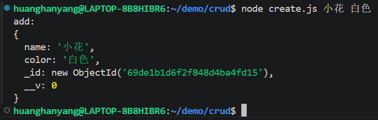

##### 2. 查询数据（Read）
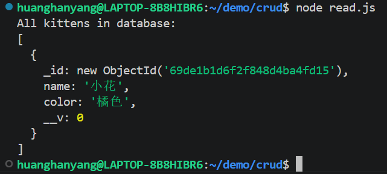

##### 3. 修改数据（Update）
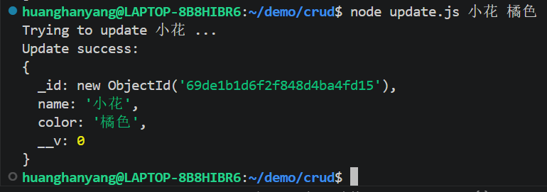

##### 4. 验证修改结果
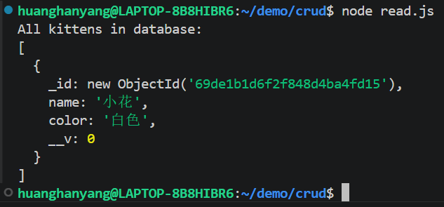

##### 5. 删除数据（Delete）
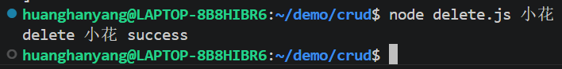

##### 6. 验证删除结果
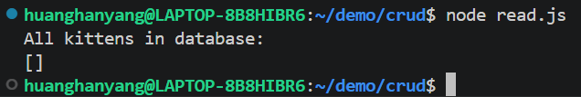

### 👤邱广浩 

**✉️ 提交邮箱**：2662939667@qq.com

#### 📌 任务分工

| 任务模块 | 任务描述 |
| :--- | :--- |
| 安装Linux虚拟机 | 成功安装Linux虚拟机 |
| 安装MongoDB容器 | 成功安装MongoDB容器 |
| 实现CRUD代码 | 成功复现CRUD代码 |


#### ✅ 提交记录

| 任务模块 | 提交编号 | 完成情况 |
| :--- | :--- | :--- |
| 安装Linux虚拟机 | 0c58920 | 已成功安装Linux虚拟机 |
| 安装MongoDB容器 | 0c58920 | 已成功安装MongoDB容器 |
| 实现CRUD代码 | 0c58920 | 已成功复现CRUD代码 |

#### 📸 运行结果截图

##### 1. 新增数据（Create）
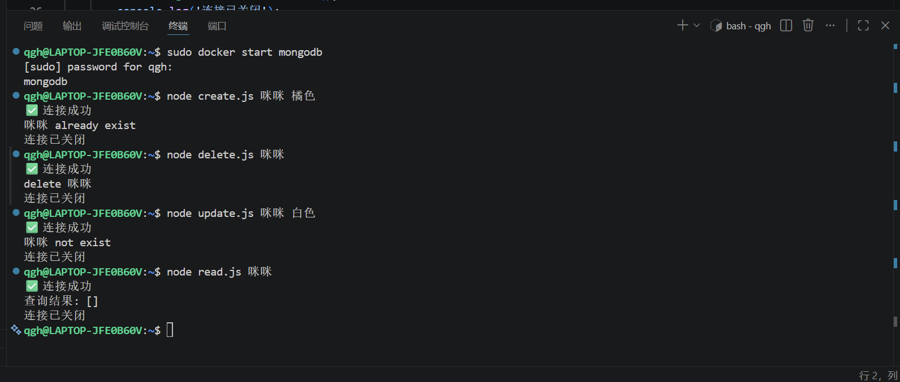

### 👤冼子谦

**✉️ 提交邮箱**：2289379563@qq.com

#### 📌 任务分工

| 任务模块 | 任务描述 |
| :--- | :--- |
| 安装wsl，mongdb | 根据教程安装wsl和mongdb |
| 实现crud代码 | 在服务器上实现crud代码 |

#### ✅ 提交记录

| 任务模块 | 提交编号 | 完成情况 |
| :--- | :--- | :--- |
| 安装wsl,mongdb | 9e76b02 | 已经完成wsl，mongdb的安装 |
| 实现crud代码 | 9e76b02 | 已在服务器上实现crud代码 |

#### 📸 运行结果截图

##### 1. 新增数据
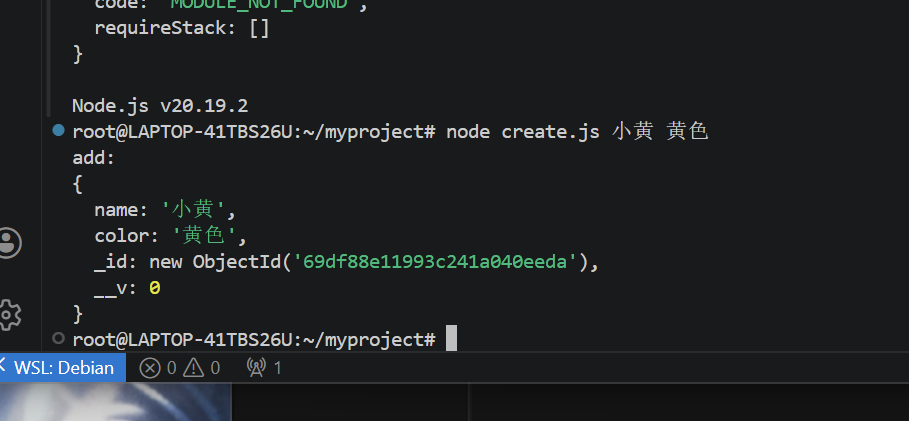

##### 2. 删除数据
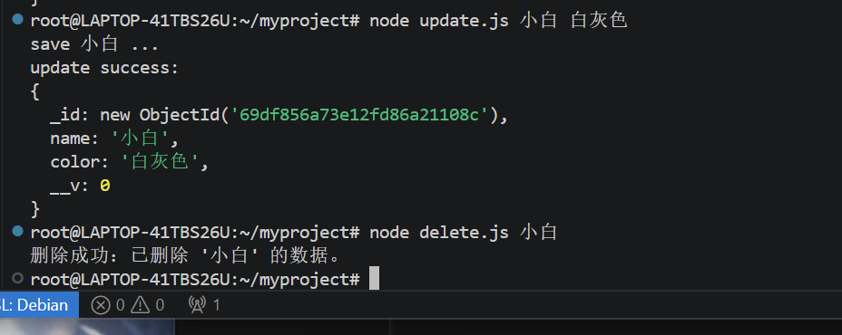

##### 3. 查找数据
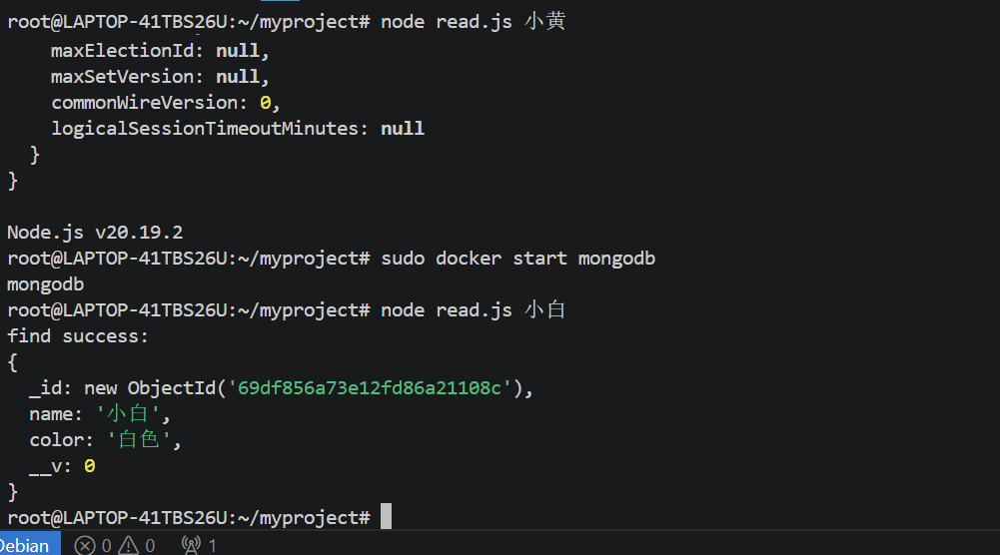

##### 4. 修改数据
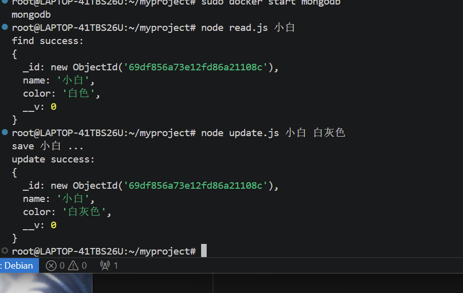


## 📝 第 6 次实验

**题目要求**

开发一个完整的"旅途笔记"旅游分享网站，要求：
1. 使用 Node.js + Express 搭建 Web 服务器，采用 MVC 分层架构
2. 使用 MongoDB 数据库存储用户、游记、评论、通知等数据
3. 实现完整的用户系统（注册/登录/session 鉴权）
4. 实现游记的发布、编辑、删除、查看（CRUD），支持多图上传
5. 实现社交互动功能（点赞、收藏、评论）
6. 界面设计美观，支持移动端响应式布局
7. 将系统部署到云端（Railway），使他人可通过公网访问

**完成情况**

全体组员共同完成了「旅途笔记」旅游分享网站的开发与部署。系统采用 MVC 分层架构，实现了注册登录、游记 CRUD、点赞收藏评论、通知系统、全文搜索、富文本编辑、交互地图、无限滚动等完整功能。界面采用毛玻璃半透明卡片风格，并做了三级响应式断点适配（平板/手机/小屏）。最终通过 Railway 平台部署上线，公网地址为 `https://travel-diary-production-2822.up.railway.app`。

<span style="color: red;">以下实验报告部分内容由"Trae AI (DeepSeek-V4-Pro)"辅助起草，黄寒阳编辑完善。</span>

**提交编号**

本次实验的最终提交编号为：（待填写）

---

### 🏗️ 系统架构

```
┌─────────────────────────────────────────────┐
│                  浏览器 / 手机                │
└─────────────────┬───────────────────────────┘
                  │ HTTP
┌─────────────────▼───────────────────────────┐
│           Express Web Server (server.js)      │
│  ┌──────────┐  ┌──────────┐  ┌───────────┐  │
│  │  Routes   │  │ Session  │  │  Multer   │  │
│  │ (路由层)  │  │ (鉴权)   │  │ (文件上传) │  │
│  └─────┬─────┘  └──────────┘  └───────────┘  │
│        │                                      │
│  ┌─────▼──────────────────────────────────┐  │
│  │         Models (Mongoose ODM)           │  │
│  │  User / Travel / Comment / Notification │  │
│  └─────┬──────────────────────────────────┘  │
└────────┼──────────────────────────────────────┘
         │
┌────────▼──────────────────────────────────────┐
│              MongoDB (Railway 云端)            │
└───────────────────────────────────────────────┘
```

**架构说明**：
- **视图层 (View)**：EJS 模板引擎，partials 复用 header/footer
- **模型层 (Model)**：Mongoose 定义 User、Travel、Comment、Notification 四个数据模型
- **控制器/路由层 (Controller)**：server.js 中按功能模块组织路由，逻辑清晰

---

### 👤 黄寒阳

**✉️ 提交邮箱**：897360868@qq.com

#### 📌 任务分工

| 任务模块 | 任务描述 |
| :--- | :--- |
| 项目架构设计 | 设计 MVC 分层架构，规划路由、模型、视图结构，搭建 Express 服务器 |
| 用户系统 | 实现注册、登录、session 鉴权，bcrypt 密码加密，中间件权限控制 |
| 游记 CRUD | 实现游记发布（Quill 富文本 + Multer 多图上传）、编辑回显、删除权限验证、列表分页 |
| 社交互动 | 实现点赞（数组去重）、收藏（用户内嵌数组）、评论（独立模型），评论也可点赞 |
| 通知系统 | Notification 模型，点赞/评论时自动生成通知，导航栏显示未读数量，支持全部已读 |
| 搜索与推荐 | 基于 MongoDB 正则的全文搜索（标题+目的地），热门游记（按浏览量排序），相关游记推荐 |
| 交互地图 | 集成 Leaflet.js + Nominatim 地理编码，根据目的地自动定位并标记 |
| 界面设计 | 毛玻璃半透明卡片 UI、固定全屏背景、热门目的地导航、加载动画、回到顶部 |
| Railway 云部署 | 修改数据库连接支持环境变量 MONGODB_URI，配置 Railway 环境变量，部署上线 |
| 响应式改造 | 三级断点（平板 1024px / 手机 768px / 小屏 480px），添加汉堡菜单 |
| 合并组员提交，完成实验报告 | 合并所有组员的实验结果与报告，并编辑优化整个实验报告 |

#### ✅ 提交记录

| 任务模块 | 提交编号 | 完成情况 |
| :--- | :--- | :--- |
| 项目架构与全部功能开发 | （待填写） | 完成整个项目的本地开发，全部功能已实现并测试通过 |
| Railway 部署与响应式优化 | （待填写） | 修改 MongoDB 连接为环境变量，完成三级响应式适配，部署到 Railway 并上线 |

#### 📸 运行结果截图

##### 1. 首页 - 桌面端


##### 2. 首页 - 手机端（响应式）


##### 3. 游记详情页（含地图、画廊、评论区）


##### 4. 发布游记（Quill 富文本编辑器）


##### 5. 个人中心


##### 6. 通知列表


##### 7. Railway 部署状态（服务 Online）


---

### 👤邱广浩 

**✉️ 提交邮箱**：2662939667@qq.com

#### 📌 任务分工

| 任务模块 | 任务描述 |
| :--- | :--- |
| （待填写） | （待组员填写） |

#### ✅ 提交记录

| 任务模块 | 提交编号 | 完成情况 |
| :--- | :--- | :--- |
| （待填写） | （待填写） | （待填写） |

#### 📸 运行结果截图

（待组员提供）

### 👤冼子谦

**✉️ 提交邮箱**：2289379563@qq.com

#### 📌 任务分工

| 任务模块 | 任务描述 |
| :--- | :--- |
| （待填写） | （待组员填写） |

#### ✅ 提交记录

| 任务模块 | 提交编号 | 完成情况 |
| :--- | :--- | :--- |
| （待填写） | （待填写） | （待填写） |

#### 📸 运行结果截图

（待组员提供）

---

## 📊 评分自评（对照评分标准）

### 1. 核心功能与代码质量 — 预估：优 (41-50分)

- ✅ **MVC 分层架构**：View (EJS) / Model (Mongoose) / Controller (routes) 清晰分离
- ✅ **代码规范性**：命名语义化、缩进统一、关键逻辑有注释
- ✅ **完整 CRUD**：游记的增删改查 + 权限验证（只有作者可编辑/删除）
- ✅ **数据校验**：注册时检查用户名邮箱唯一性、密码一致性；删除前二次确认
- ✅ **错误处理**：数据库连接失败、游记不存在、无权限操作等均有处理
- ✅ **超越 blog 示范**：四个数据模型关联查询（populate）、通知系统、session 鉴权中间件

### 2. 界面设计与用户体验 — 预估：优 (26-30分)

- ✅ **独特视觉风格**：毛玻璃效果（backdrop-filter）、半透明卡片、固定全屏旅游大片背景
- ✅ **卡片式布局**：目的地卡片、游记卡片统一风格，悬停上浮动画
- ✅ **三级响应式断点**：平板 (1024px) / 手机 (768px) / 小屏 (480px)
- ✅ **汉堡菜单**：手机端自动切换为侧滑导航面板
- ✅ **交互细节**：加载动画（淡入上浮 + 错位延迟）、回到顶部按钮、无限滚动

### 3. 创新与超越 — 预估：优 (16-20分)

- ✅ **全文搜索**：MongoDB 正则查询，支持标题和目的地模糊搜索
- ✅ **权限管理系统**：session 鉴权中间件，游记/评论的操作权限验证
- ✅ **实时通知系统**：点赞/评论自动通知作者，未读数量显示，全部已读
- ✅ **交互地图**：Leaflet.js + Nominatim 地理编码，免费无需 API Key
- ✅ **富文本编辑器**：Quill.js 集成，支持加粗/斜体/标题/列表/链接/图片
- ✅ **无限滚动加载**：IntersectionObserver 监测触底，动态请求追加内容
- ✅ **云端部署**：Railway + MongoDB，公网可访问